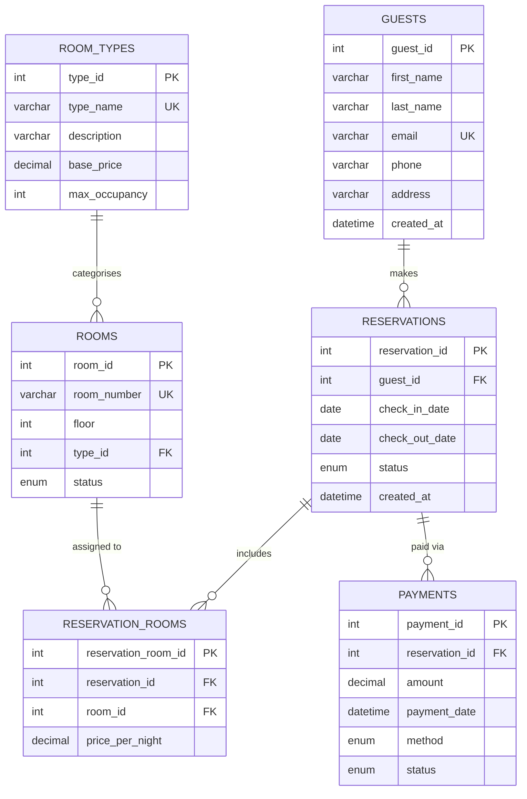

# Hotel Reservation System — ER Diagram

The entity-relationship diagram below is rendered with [Mermaid](https://mermaid.js.org/).
GitHub renders Mermaid diagrams natively in Markdown files.

## Relationship Summary

| Relationship | Cardinality | Description |
|---|---|---|
| GUESTS → RESERVATIONS | One-to-Many | A guest can have multiple reservations |
| RESERVATIONS → RESERVATION_ROOMS | One-to-Many | A reservation can cover multiple rooms |
| ROOMS → RESERVATION_ROOMS | One-to-Many | A room can appear in many reservations (at different times) |
| ROOM_TYPES → ROOMS | One-to-Many | A room type groups many rooms |
| RESERVATIONS → PAYMENTS | One-to-Many | A reservation can have multiple payment records (e.g. deposit + balance) |

## Normalisation Notes (3NF)

* **ROOM_TYPES** was extracted from **ROOMS** to eliminate the transitive dependency
  `room_id → type_name → base_price`.  Room-type attributes depend only on the type,
  not on the room number.
* **RESERVATION_ROOMS** (junction table) resolves the many-to-many relationship between
  **RESERVATIONS** and **ROOMS** and stores the price snapshot at booking time,
  avoiding update anomalies when base prices change later.
* All non-key attributes in every table depend solely on the primary key —
  satisfying First, Second, and Third Normal Form.
